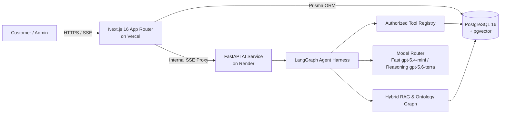
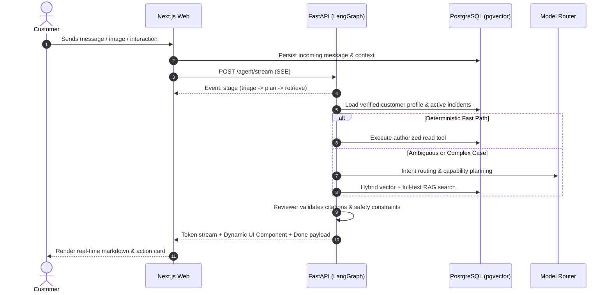

# 🌐 OmniCare AI — Enterprise Customer Support Hub

<p align="center">
  
  
  
  
  
  
  
</p>

<p align="center">
  <b>A Production-Ready, Multitask AI Customer Support Platform with Transactional Grounding, Hybrid RAG + Knowledge Graph, Dynamic Human Handoff, and Zero-Hallucination Guardrails.</b>
</p>

---

## 🚀 Live Deployments & Health Endpoints

| Environment | Service | URL / Status | Description |
|:---|:---|:---|:---|
| **Production Web** | Customer & Admin Portal | [omnicare-chatagent.vercel.app](https://omnicare-chatagent.vercel.app) | Next.js 16 web app hosted on Vercel |
| **AI Microservice** | FastAPI Agent Backend | [`/health` endpoint](https://omnicare-ai-service.onrender.com/health) | LangGraph agent runtime on Render |
| **API Contract** | Streaming SSE & Tools | `/agent/stream` | Token stream + live UI interaction payload |

---

## 🏛️ System Architecture

OmniCare couples trusted relational transaction records with vector-indexed knowledge bases and deterministic tool governance.



---

## ⚡ Key Highlights & Core Capabilities

### 1. 🛡️ Trust & Zero-Forged Identity Context
- **Verified Actor Binding**: The client browser never supplies a trusted `customer_id`. Identity is resolved server-side from session tokens and injected into agent runtime calls.
- **SQL Ownership Enforcement**: All read/write tools verify that requested order IDs and transaction records belong strictly to the authenticated user.

### 2. 🤖 Adaptive Agent Workflow (LangGraph Engine)
- **Model Router**:
  - `Fast Model` (`cx/gpt-5.4-mini`): Ultra-low latency intent parsing, deterministic fast-path retrieval, and routine queries.
  - `Reasoning Model` (`cx/gpt-5.6-terra`): Complex disputes, multi-intent resolutions, evidence conflicts, and risk assessment.
- **Dual-Stage Reviewer**: Deterministic checks verify citation validity, ownership, and tool budget before tokens are finalized. Semantic LLM judge evaluates output against ground truth.

### 3. 🔍 Hybrid RAG & Knowledge Graph Ontology
- **3-Layer Search Engine**: Dense vector similarity (`pgvector`) + Sparse full-text BM25 lexical search + Domain entity ontology traversal (e-commerce concepts).
- **Anti-Hallucination Filtering**: Internal, draft, expired, or archived documents are strictly blocked from public citations.

### 4. 💳 Transaction Execution with Tiered Approvals
- **Idempotency Safeguard**: Every transactional mutation uses an `idempotency_key` to prevent double-charging or duplicate cancellations.
- **Tiered Risk Matrix**:
  - `READ`: Authenticated access (order status, shipment location, refunds).
  - `MEDIUM/HIGH` (`cancel_order`, `return_request`, `checkout`): Requires explicit **Customer Confirmation Modal** via dynamic UI cards.
  - `CRITICAL` (`create_refund`): Requires **Human Agent Approval** via Admin Ticket Dashboard.

---

## 🔄 End-to-End Chat & Action Lifecycle



---

## 📦 Tech Stack & Tooling

| Domain | Technology | Details |
|:---|:---|:---|
| **Frontend** | Next.js 16.2, React 19.2, Tailwind CSS | App Router, Server Actions, Dynamic UI Cards, SSE Reader |
| **Database & ORM** | PostgreSQL 16, pgvector, Prisma 6.18 | Hybrid embeddings, relation schemas, audit logs, checkpoints |
| **AI Orchestration** | FastAPI, LangChain 1.x, LangGraph 1.x | StateGraph workflow, tool budget middleware, SSE emitter |
| **LLM Models** | `gpt-5.4-mini` (Fast) / `gpt-5.6-terra` (Reasoning) | Profile-based routing with complexity score thresholding |
| **Testing & QA** | Python `unittest`, Playwright, Node.js | Unit tests, holdout evaluation benchmarks, E2E flow tests |
| **Deployments** | Vercel (Web), Render (AI Service) | Production multi-region setup with automated CI/CD |

---

## 📊 Anti-Overfit Holdout Benchmarks

OmniCare evaluates conversational grounding using a deterministic **300-case canary holdout dataset** generated across 100 realistic support scenarios with synthetic perturbations.

| Benchmark Suite | Metric | Score | Status |
|:---|:---|:---|:---|
| **Deterministic Structural Gate** | Routing, tool permission, citation schema | **100.0%** (300/300) | `PASSED` |
| **Canary Hybrid Release Gate** | Factuality, completeness, citation relevance | **94.0%** (282/300) | `PASSED` (>=90% target) |
| **Core Unit Tests** | Python AI Service + Tool policies | **100.0%** (35/35) | `PASSED` |
| **Streaming Latency (TTFT)** | Pipeline acceptance time | **P50: 8 ms** / P95: 1.8s | `OPTIMAL` |

---

## 📁 Repository Structure

```text
OmniCare-ChatAgent/
├── apps/
│   ├── web/                     # Next.js 16 frontend & API gateway
│   │   ├── src/app/             # App router (Customer portal, Admin dashboard, Help Center)
│   │   ├── src/components/      # UI components, chat widget, interaction cards
│   │   ├── src/lib/             # Auth, Prisma client, SSE adapters, security helpers
│   │   └── prisma/              # Prisma schema & migrations
│   └── ai-service/              # FastAPI + LangGraph AI engine
│       ├── app/
│       │   ├── agent/           # LangGraph runtime, nodes, edges & model router
│       │   ├── tools/           # ToolRegistry (customer, order, refund, RAG)
│       │   ├── retrieval/       # Hybrid vector + lexical search & graph builder
│       │   └── evaluation/      # Continuous evaluation & judge harness
│       └── tests/               # Python unit and integration tests
├── datasets/                    # Holdout evaluation suites & benchmarks
├── docs/                        # Deep-dive architecture & technical specs
│   ├── architecture.md          # Full system architecture & state machine
│   ├── technical-inventory.md   # Model profiles, tool registries & API routes
│   └── holdout-evaluation.md    # Canary evaluation methodologies & results
├── tests/                       # Playwright E2E test suites (production & handoff)
└── docker-compose.yml           # Full-stack local orchestration
```

---

## 🛠️ Getting Started (Local Development)

### Prerequisites
- **Node.js**: `v20.x` or higher
- **Python**: `3.13`
- **Docker & Docker Compose** (Recommended)
- **PostgreSQL 16** with `pgvector` extension

### 1. Clone & Configure Environment

```bash
git clone https://github.com/Minwsun/omnicare-chatagent.git
cd omnicare-chatagent
cp .env.example .env
```

> **Note**: Populate `.env` with your local PostgreSQL credentials and OpenAI/Gemini-compatible LLM API keys. Never commit `.env` or sensitive credentials.

### 2. Run via Docker Compose (Recommended)

```bash
docker compose up --build
```
- **Web App**: `http://localhost:3000`
- **AI Service Health**: `http://localhost:8000/health`
- **PostgreSQL / pgvector**: `localhost:5432`

---

## 🧪 Testing & Verification

Run the full verification suite across web and AI services:

```bash
# 1. Run AI Service Unit Tests
npm test

# 2. Run Evaluation & Benchmark Audit
npm run eval:audit

# 3. Web Linting & Production Build Check
npm --prefix apps/web run lint
npm --prefix apps/web run build

# 4. Run Playwright E2E Tests against Production
npm run test:e2e:production
npm run test:e2e:handoff
```

---

## 📚 In-Depth Documentation

- 📖 [System Architecture & State Machine Specification](docs/architecture.md)
- 🛠️ [Technical Inventory: APIs, Tools & Model Profiles](docs/technical-inventory.md)
- 🎯 [Anti-Overfit Holdout Evaluation Methodology](docs/holdout-evaluation.md)
- 🌐 [Production Deployed User Guide](docs/deployed-web-guide.md)

---

## 📄 License & Attribution

Distributed under the **ISC License**. Built with ❤️ for enterprise-grade autonomous customer experience.
