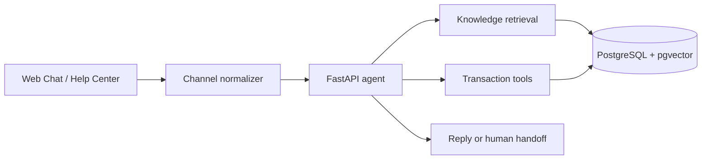
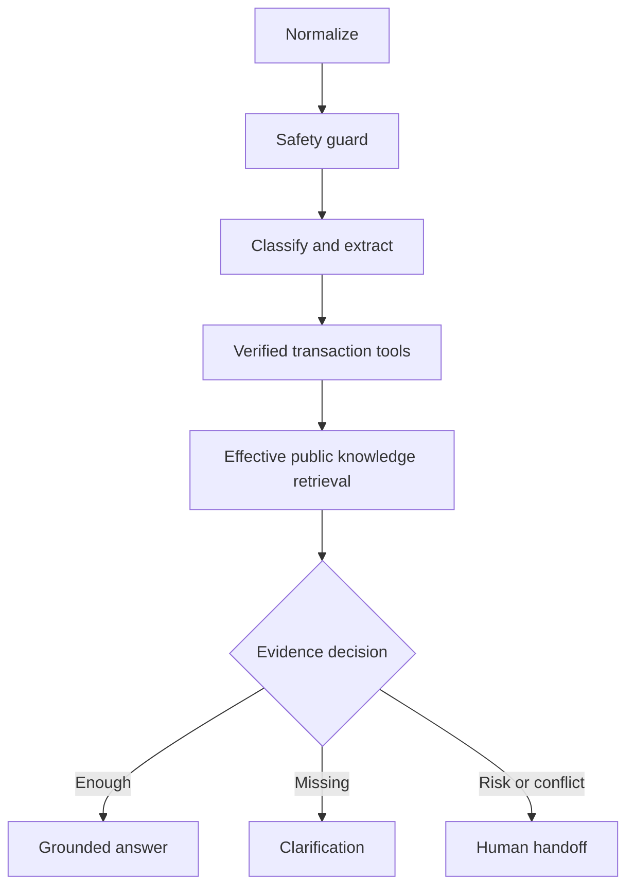

# Architecture

## Agent graph

Transaction tools enforce customer identity and order ownership in SQL. Knowledge retrieval filters visibility, publication state and effective dates before ranking.
