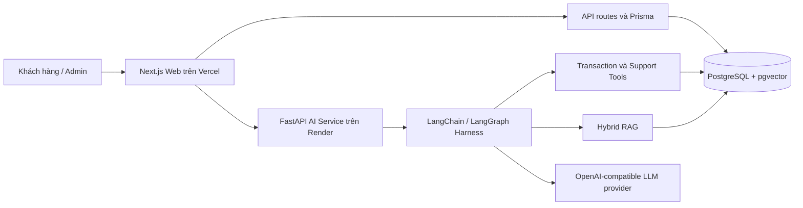
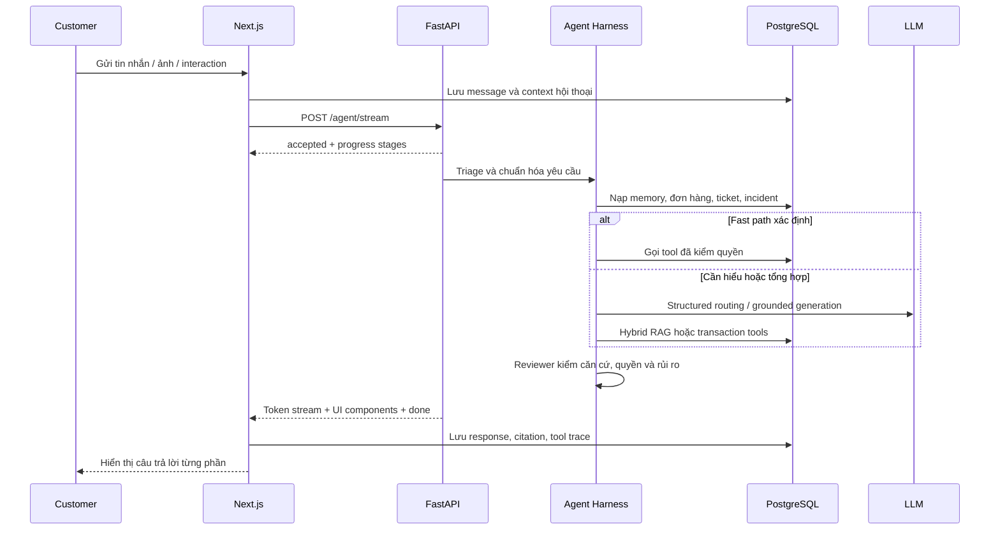
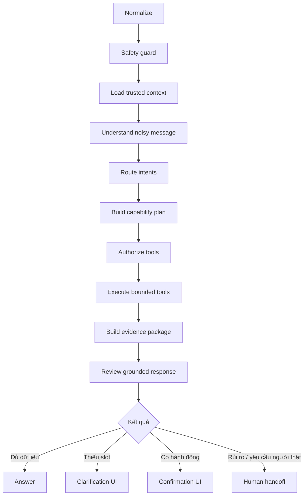
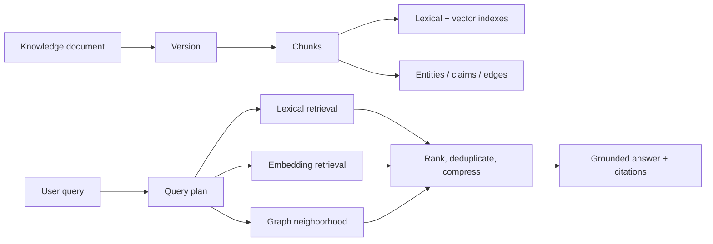

# Kiến trúc hệ thống OmniCare

Tài liệu mô tả trạng thái source code ngày 2 tháng 8 năm 2026. Đây là hệ thống hỗ trợ khách hàng đa tác vụ, kết hợp dữ liệu giao dịch đã xác minh, Knowledge Base có dẫn nguồn, agent workflow và chuyển tiếp cho nhân viên.

## 1. Tổng quan

| Lớp | Trách nhiệm |
| --- | --- |
| Web | Đăng nhập, portal khách hàng, popup chat, đơn hàng, Help Center, admin inbox, Knowledge và AI Runs. |
| Web API | Xác thực session, lưu hội thoại, proxy stream AI, quản lý KB, ticket và interaction UI. |
| AI service | Triage, hiểu ý định, lập kế hoạch, gọi tool, truy xuất RAG, review câu trả lời và handoff. |
| PostgreSQL | Dữ liệu tài khoản, giao dịch, hội thoại, memory, ticket, KB, graph, AI trace và audit. |
| LLM provider | Hiểu ngôn ngữ nhiễu, tổng hợp câu trả lời, reasoning trường hợp phức tạp và reviewer. |

## 2. Luồng chat

SSE phát các stage như tiếp nhận, tìm hiểu, đối chiếu dữ liệu, xử lý và hoàn tất. `done` mang `GroundedAgentResponse`, gồm câu trả lời, intent, confidence, citation, tool calls, UI, pending action và trạng thái handoff.

## 3. Agent harness

Harness production dùng `LangChainAgentRuntime` khi `LANGCHAIN_AGENT_ENABLED=true`; runtime cũ chỉ là fallback cấu hình.

Nguyên tắc:

- Deterministic fast path xử lý intent rõ, giảm latency và chi phí LLM.
- Semantic routing chỉ bổ sung khi câu nhiễu, đa ý định hoặc confidence thấp.
- Trusted customer context được backend gắn vào runtime; model không tự khai báo `customer_id`.
- Tool budget và model-call middleware giới hạn vòng lặp agent.
- Reviewer chặn sai order ID, citation nội bộ, tool trái policy và confidence không có căn cứ.
- Câu hỏi ngoài phạm vi được từ chối tự nhiên; yêu cầu gặp người thật luôn ưu tiên handoff.

## 4. Tool và kiểm soát hành động

`ToolRegistry` là nguồn chuẩn cho danh sách tool, nhóm kỹ năng, READ/WRITE, mức rủi ro, role và approval.

- READ tool cần identity khi truy cập dữ liệu cá nhân; SQL luôn kiểm ownership đơn hàng.
- WRITE tool dùng idempotency key để tránh tạo hành động trùng.
- Hủy đơn, trả hàng, tra soát và checkout cần customer confirmation.
- Hoàn tiền là `CRITICAL`, cần human approval.
- Model chỉ đề xuất `PendingAgentAction`; endpoint confirm mới thực thi hành động được phép.

## 5. RAG và Knowledge Base

Pipeline KB:

1. Admin nạp tài liệu với title, content, visibility, loại và mức ưu tiên.
2. Hệ thống tạo document/version/chunk và ingestion run.
3. Worker xây embedding khi provider được cấu hình, đồng thời cập nhật graph provenance.
4. Chỉ document published, còn hiệu lực, đúng visibility và chưa archive được retrieval công khai.
5. Retrieval lập `QueryPlan`, lấy tối đa số chunk cấu hình, loại trùng và nén theo truy vấn.
6. Citation giữ document, version, section, effective date, URL và score.

Archive loại tài liệu khỏi UI Knowledge và retrieval nhưng giữ lịch sử/audit. Restore hoặc reindex tạo lại trạng thái tìm kiếm. Graph là lớp hỗ trợ truy xuất và provenance; tài liệu gốc vẫn là nguồn sự thật.

## 6. Conversation memory

- `Conversation` và `Message` giữ lịch sử đầy đủ theo tài khoản.
- `ConversationMemory`, `MemoryNode`, `MemoryEdge` và `CustomerMemoryFact` giữ context đã chuẩn hóa.
- Runtime chỉ nạp active context, facts và snapshot liên quan; không nhồi toàn bộ lịch sử vào prompt.
- Order ID được lấy theo thứ tự: nội dung hiện tại, order đang chọn, page context, rồi conversation history.
- Interaction UI gửi semantic payload như order, product, quantity hoặc confirmation để tiếp tục đúng intent trước đó.

## 7. Human handoff

Handoff được kích hoạt khi khách yêu cầu nhân viên, case khẩn cấp, thiếu dữ liệu quan trọng, evidence xung đột, tool bị chặn hoặc reviewer đánh giá không an toàn.

1. AI đặt `requires_human`, `handoff_requested`, reason, category và priority.
2. Ticket được tạo idempotent theo fingerprint/conversation.
3. Admin thấy ticket trong Inbox, mở toàn bộ hội thoại và claim.
4. Khi admin tham gia, chat tiếp tục trong cùng conversation; customer nhận message nguồn `HUMAN_ADMIN`.
5. AI Assist tạo gợi ý dựa trên conversation context nhưng admin quyết định nội dung gửi.

## 8. Dữ liệu chính

Nhóm model Prisma:

- Identity: `UserAccount`, `AuthSession`, `LoginAttempt`, `Customer`, `Address`.
- Commerce: `Product`, `CheckoutSession`, `Order`, `OrderItem`, `Payment`, `Shipment`, `Refund`, `CommerceAction`.
- Conversation: `Conversation`, `Message`, `ChatAttachment`, memory nodes/edges/facts/snapshots.
- Support: `Ticket`, `TicketEvent`, `ServiceIncident`.
- Knowledge: document/version/chunk/source/snapshot/category, graph entities/edges/claims, ingestion, reviews, feedback và gaps.
- Observability: `AiRun`, `AiStep`, `AiToolCall`, `AiRetrievalResult`, `AuditLog`.

## 9. Cache và hiệu năng

- Deterministic routing tránh model call cho intent rõ.
- `AsyncTTLCache` coalesce request đồng thời, cache embedding và retrieval.
- Retrieval giới hạn token/chunk bằng `RETRIEVAL_TOKEN_BUDGET` và `RETRIEVAL_MAX_CHUNKS`.
- Transaction fast path gọi tối thiểu tool công khai cần thiết.
- SSE trả progress ngay trước khi xử lý dài, sau đó stream token model.
- PostgreSQL có index cho conversation, runtime latency, KB search và graph lookup.

## 10. Triển khai và vận hành

| Thành phần | Production |
| --- | --- |
| Web | Vercel: `https://omnicare-chatagent.vercel.app` |
| AI | Render: `https://omnicare-ai-service.onrender.com` |
| Database | Render PostgreSQL; connection string chỉ qua secret environment |

Render chạy AI service từ Dockerfile và health check `/health`. Vercel chạy Prisma migrations trước build. Các secret bắt buộc gồm `DATABASE_URL`, `LLM_API_KEY`; model và provider URL được cấu hình qua environment.

## 11. Quan sát và xử lý lỗi

- `/health` báo trạng thái service, DB, LLM và model đang dùng.
- AI Runs lưu stage, latency, model profile, tool calls, retrieval và review status.
- Ticket Event giữ lịch sử claim, reply, status và handoff.
- Knowledge ingestion run có trạng thái và stream tiến độ riêng.
- Khi LLM không sẵn sàng, API trả lỗi provider thay vì dựng câu trả lời giả.
- Khi DB lỗi, startup/health phải fail; không fallback sang dữ liệu mock production.

## 12. Giới hạn hiện tại

- Channel thực tế là web; email mới ở mức contract/simulator.
- Vector retrieval phụ thuộc `EMBEDDING_MODEL`; lexical retrieval vẫn hoạt động khi chưa cấu hình embedding.
- Policy marketplace là nguồn tham khảo nhập vào KB, không phải cam kết đại diện cho marketplace.
- Demo account và dữ liệu seed không được dùng như production identity thật.
